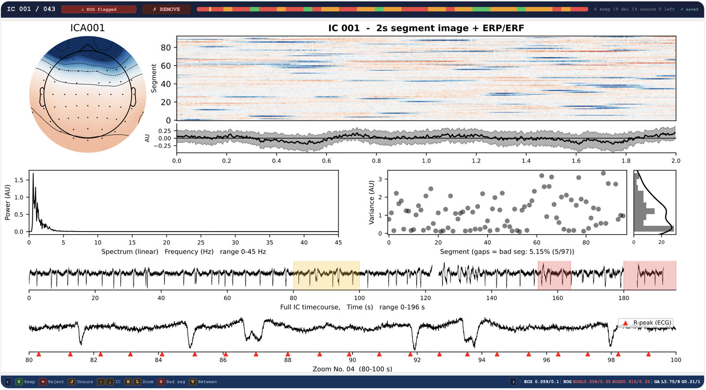
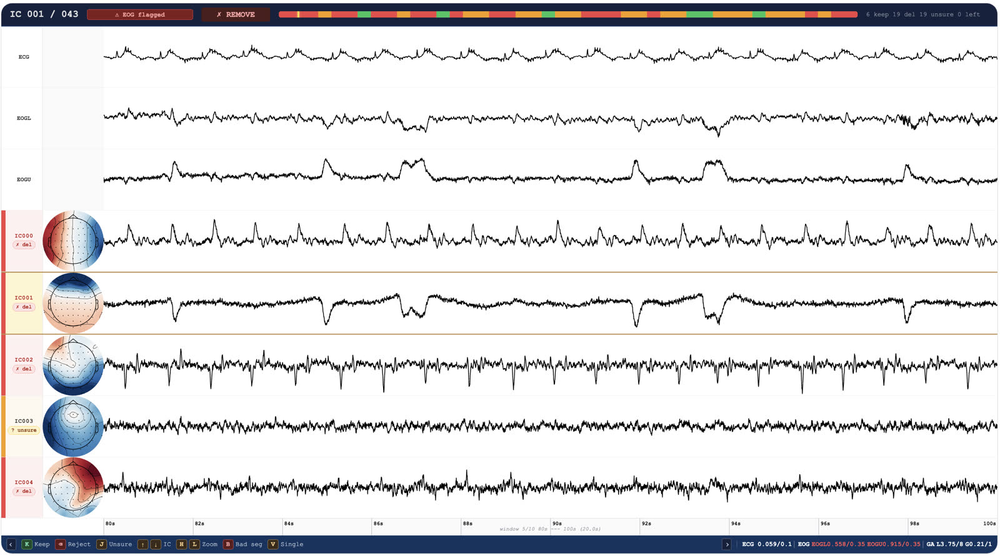

# OSL: Electrophysiological Data Analysis Toolbox

Tools for analysing electrophysiological (M/EEG) data.

Documentation: https://osl-ephys.readthedocs.io/en/latest/.

## Installation

We recommend installing osl-ephys in a Conda environment.

### Conda / mamba

[Miniforge](https://github.com/conda-forge/miniforge) (`conda`/`mamba`) can be
installed on Linux or macOS with:

```bash
wget "https://github.com/conda-forge/miniforge/releases/latest/download/Miniforge3-$(uname)-$(uname -m).sh"
bash Miniforge3-$(uname)-$(uname -m).sh
rm Miniforge3-$(uname)-$(uname -m).sh
```

### osl-ephys

Install osl-ephys from its source checkout:

```bash
git clone https://github.com/OHBA-analysis/osl-ephys.git
cd osl-ephys
mamba env create -f envs/osle.yml
conda activate osle
python -m pip install -e .
```

Check the active installation with
`python -c "import osl_ephys; print(osl_ephys.__version__)"`.

On a headless server, you may also need:

```bash
export PYVISTA_OFF_SCREEN=true
```

### Oxford-specific computers

On an OHBA workstation (HBAWS), use:

```bash
git clone https://github.com/OHBA-analysis/osl-ephys.git
cd osl-ephys
mamba env create -f envs/hbaws.yml
conda activate osle
python -m pip install -e .
```

On the BMRC cluster, use:

```bash
git clone https://github.com/OHBA-analysis/osl-ephys.git
cd osl-ephys
mamba env create -f envs/bmrc.yml
conda activate osle
python -m pip install -e .
```

Remember to set `PYVISTA_OFF_SCREEN=true` when visualising on a headless
cluster.

## Removing osl-ephys

Remove the Conda environment with `conda env remove -n osle`. After confirming
you are in the checkout's parent directory and no longer need local changes,
delete the cloned `osl-ephys` directory.

## Interactive manual ICA review

The browser-based [manual ICA tutorial](doc/source/tutorials/preprocessing_manual-ica.py)
shows how to fit ICA, inspect and label components, mark bad intervals, and
apply the saved decisions. It uses a noisy simultaneous EEG-fMRI recording as
an example, but the review workflow works with any OSL-Ephys EEG preprocessing
pipeline; TR and slice timing are only needed for the optional gradient-artifact
score.

Watch the [manual ICA review walkthrough](https://drive.google.com/file/d/1IxYQBHKlFOTMEGhLchoDoy79Gb7gTN9H/view?usp=sharing)
for a demonstration of the browser interface.

| Single-component review | Between-component comparison |
| --- | --- |
| [](doc/source/images/manual_ica/single_ic.jpg) | [](doc/source/images/manual_ica/between_ic.jpg) |

Click either screenshot to enlarge it.

To generate the manual ICA tutorial as a notebook without executing its code:

```bash
python -m pip install -e ".[doc]"
sphinx-build -b html -D sphinx_gallery_conf.plot_gallery=0 doc/source build/html
ls doc/source/tutorials_build/preprocessing_manual-ica.ipynb
```

## SEMP: simultaneous EEG-fMRI preprocessing

SEMP adds simultaneous EEG-fMRI artifact removal to the existing OSL-Ephys
preprocessing workflow.

[EEG-fMRI preprocessing tutorial](doc/source/tutorials/preprocessing_eeg-fmri.py):
inspect NATVIEW acquisition metadata, run SEMP step by step, and compare
sensor-space output.

Like the manual ICA tutorial, generate the SEMP notebook with Sphinx-Gallery
without running its data-dependent code:

```bash
sphinx-build -b html -D sphinx_gallery_conf.plot_gallery=0 doc/source build/html
ls doc/source/tutorials_build/preprocessing_eeg-fmri.ipynb
```

## For developers

Install development and documentation requirements with
`python -m pip install -r requirements.txt` (after the editable install above).

Run the full tests from the repository root with `pytest osl_ephys/tests`, or
run one file with `pytest osl_ephys/tests/test_file_handling.py`.

Build documentation without executing tutorials that require external data:

```bash
sphinx-build -b html -D sphinx_gallery_conf.plot_gallery=0 doc/source build/html
```

Compiled docs can be found in `build/html/index.html`.
